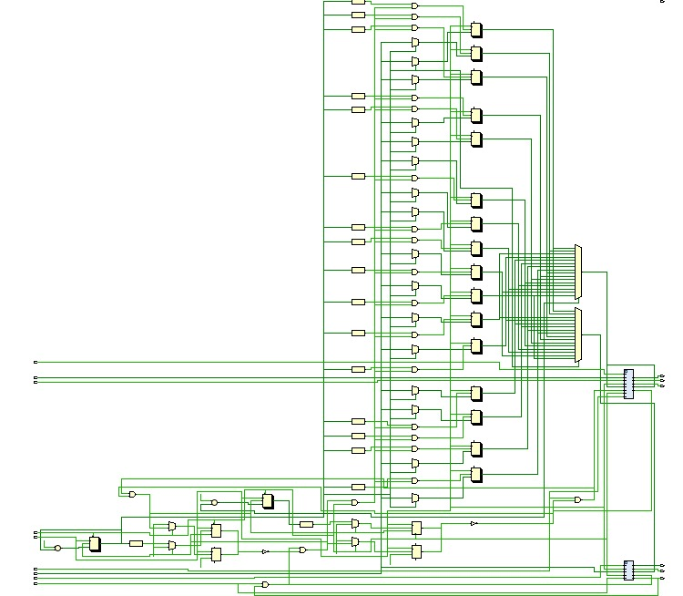

# AXI4-Based DMA Controller (SystemVerilog) 🚀  

## 📝 Project Overview  
This project implements a **high-speed AXI4-Based Direct Memory Access (DMA) Controller** using **SystemVerilog**.  
The DMA controller allows efficient **data transfer between memory and peripherals** with **minimal CPU involvement**, improving system performance.  

🔹 **Designed for high-speed memory transfers**  
🔹 **Uses the AXI4 protocol for efficient communication**  
🔹 **Supports burst transactions for faster data movement**  
🔹 **FIFO buffering for smooth and controlled transfers**  
🔹 **Clock gating for power optimization**  

---

## 📌 What is DMA?  
**Direct Memory Access (DMA)** is a method that allows hardware subsystems to transfer data **directly between memory and peripherals** **without CPU intervention**.  
This improves performance by freeing up the processor to handle other tasks instead of managing data transfers manually.  

🚀 **Key Benefits of DMA:**  
✅ **Faster Data Transfer** – Uses dedicated hardware instead of CPU instructions.  
✅ **Reduces CPU Overhead** – CPU is free to execute other tasks.  
✅ **Power Efficient** – With clock gating, unused sections are disabled, saving energy.  

---

## 📷 Circuit Schematic  

### 🔹 **How It Works**  
1️⃣ **AXI Master reads data from source memory**  
2️⃣ **Data passes through FIFO buffering for smooth transfer**  
3️⃣ **AXI Slave writes data to destination memory**  
4️⃣ **Interrupt signals notify the processor when the transfer is complete**  

By implementing **burst-based data movement**, the controller achieves **high efficiency with reduced latency**.  
